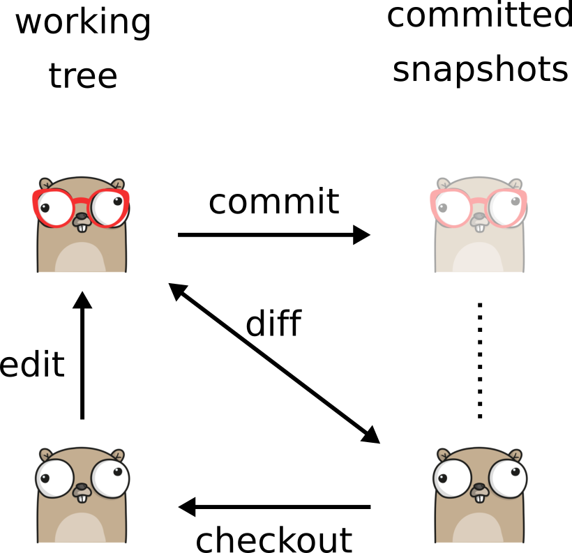
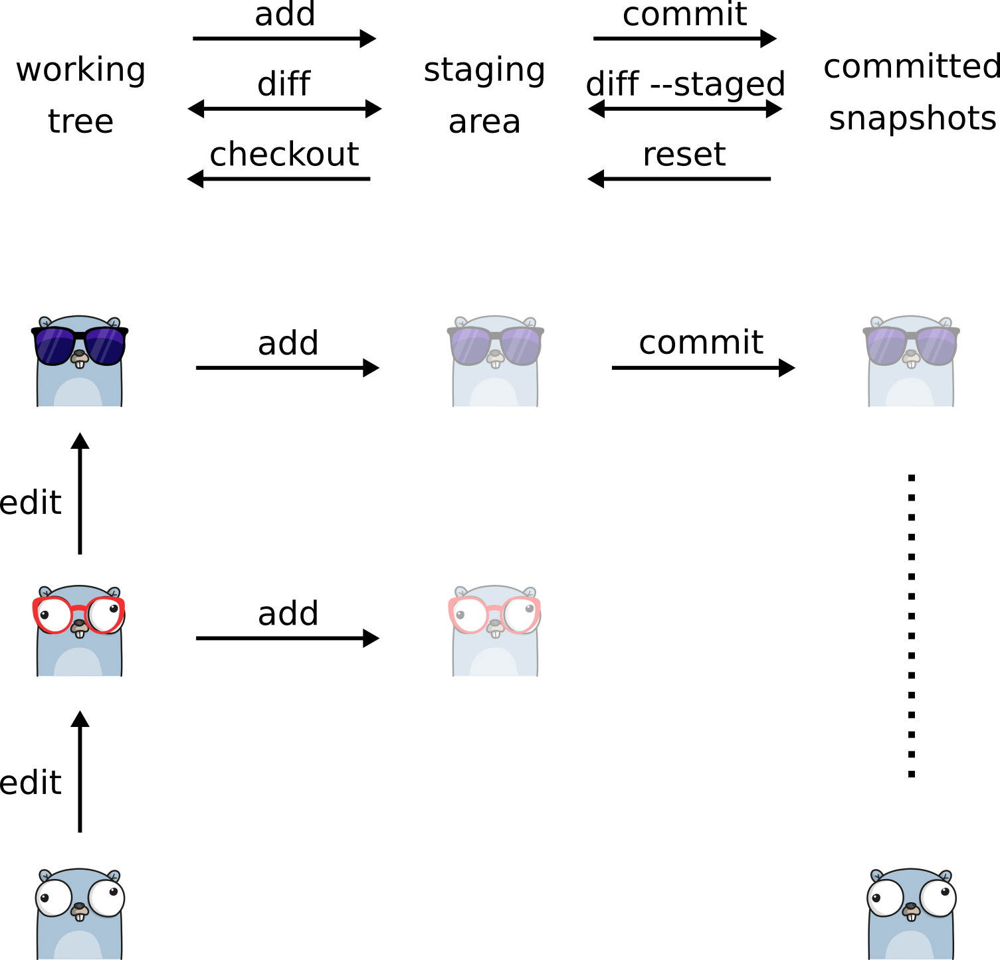
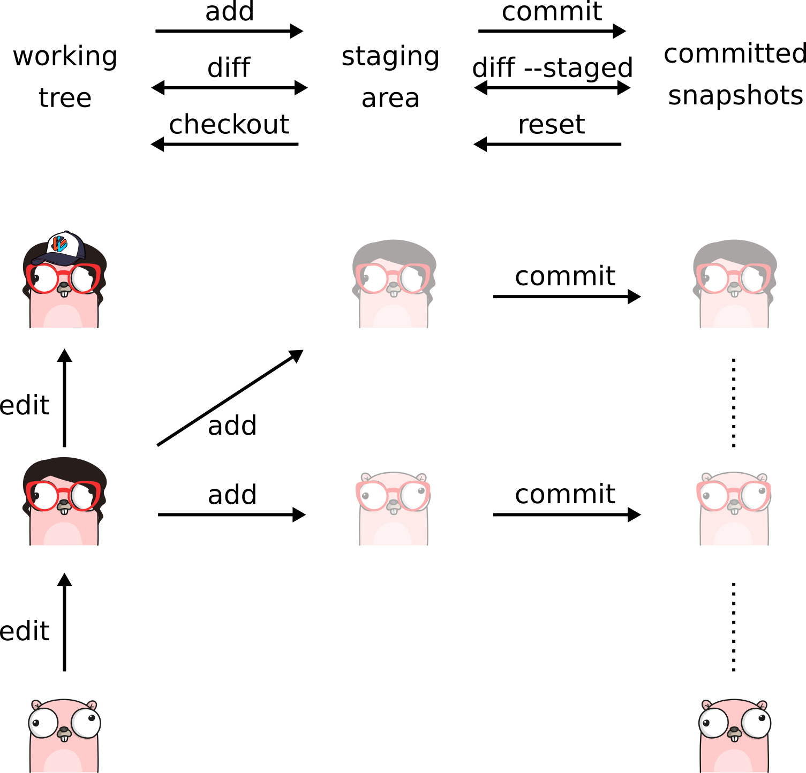

# Git staging with gophers

- Inspired by https://twitter.com/jay_gee/status/703360688618536960.
- Images created using the wonderful https://gopherize.me/.

---

### Working without staging area ([png](without-staging.png), [svg](without-staging.svg))

---

### Using the staging area to prepare a commit ([png](staging-prepare-commit.png), [svg](staging-prepare-commit.svg))

---

### Using the staging area to disentangle unrelated changes ([png](disentangle-unrelated-changes.png), [svg](disentangle-unrelated-changes.svg))

